# ESPHome · Guition ESP32-S3-4848S040
### A fully-featured smart home display — built on ESPHome + LVGL

---

## Overview

A complete, production-ready smart home dashboard for the **Guition ESP32-S3-4848S040** 480×480 touch display. Built on top of ESPHome and LVGL, this firmware turns the panel into a rich control centre for Home Assistant — with real-time weather, calendar, HVAC, lights with colour temperature, fans, covers/blinds, media player, vacuum, alarm, scene shortcuts, presence indicators, screensaver, and notification banners.

> Original credit: [alaltitov](https://github.com/alaltitov/Guition-ESP32-S3-4848S040).

---

## Features

| Category | Details |
|---|---|
| **Home screen** | Time (12h/24h), date, indoor temp (°F/°C), weather icon + title-cased condition, up to 4 upcoming calendar events |
| **Presence indicators** | Up to 4 person entities shown as initials in the top bar — green when home, dim when away; tap to open full People page |
| **People page** | Card per person showing avatar initials, full name from HA, and home/away status |
| **Screensaver** | Activates on idle — Digital clock, Flip clock (Gluqlo retro style, default), or None (screen off); optional calendar event overlay on Digital/Flip; tap anywhere to wake and return to home |
| **Notification banner** | Write any text to an `input_text` entity in HA — a toast banner appears for 10 s; tap to dismiss early |
| **Weather** | Current conditions with title-cased state + 5-day forecast with high/low temps, weather icons, and rain probability |
| **Calendar** | Up to 4 upcoming events pulled live from Home Assistant via template sensors |
| **HVAC** | Combined heating + cooling widget with arc temperature control; or separate thermostat / AC widgets |
| **Lights** | Up to 6 configurable slots (`light` / `switch` / `input_boolean`); brightness slider; auto-detected colour temperature slider |
| **Fans** | Up to 6 configurable fan slots (`fan` / `switch` / `input_boolean`) with speed control; short-press toggles, long-press opens detail page |
| **Covers** | Up to 6 cover/blind/shutter slots — position bar, Open/Stop/Close buttons, position slider; per-slot icon configurable by name |
| **Scene shortcuts** | Up to 6 scene/script/automation tiles with configurable labels and per-slot icons |
| **Media Player** | Album art, track info, progress bar, playback controls, volume slider |
| **Vacuum** | Animated robot body, battery, state, start/pause/dock controls |
| **Alarm Panel** | Disarm / Home / Away / Night / Vacation modes with PIN entry |
| **Devices hub** | Navigation to Alarm, Media, Vacuum, HVAC, Fans, Shortcuts, and Covers; optional buttons (Fans, Shortcuts, Covers) are hidden and reordered automatically when all their slots are `sensor.disabled` |
| **Settings** | Language (9 languages), colour theme, 12h/24h clock, °F/°C unit, backlight brightness, auto-sleep timer, screensaver style |
| **Settings defaults** | Language: English (US) · Theme: Dark · Backlight: 100% · Sleep: 120 s · Clock: 12h · Temp: °F · Screensaver: Flip |
| **Themes** | 6 built-in themes: Cherry Blossom, Dark, Espeon, Ocean, Paris, Patriotic |
| **Navigation** | Persistent bottom nav bar (Home / Lights / Devices / Settings); entity detail pages hide the bar and show a back button |
| **Multi-device** | Copy `main.yaml` and rename — each file is a fully independent device; `preferences.yaml` lets you rename pages and labels globally |
| **OTA overlay** | Backlight dims smoothly during firmware uploads — no screen corruption or tearing |
| **Remote screenshot** | HTTP endpoint at `http://<device>.local/screenshot` returns a live BMP of the current screen; `/screenshot/info` returns JSON metadata |
| **Localisation** | 9-language runtime translation engine — all page titles and settings labels update live without a recompile |

---

## Widgets

| Alarm Panel | Media Player | Vacuum |
|:---:|:---:|:---:|
| 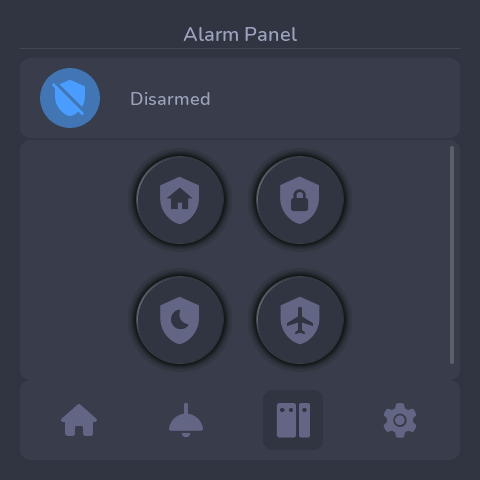 | 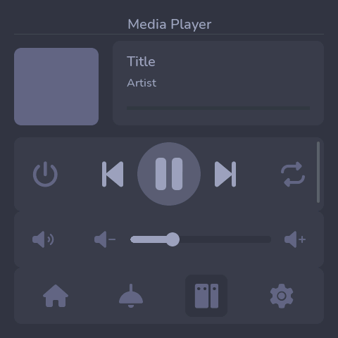 | 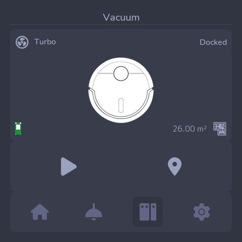 |

| Devices Hub | Settings (1) | Settings (2) |
|:---:|:---:|:---:|
| 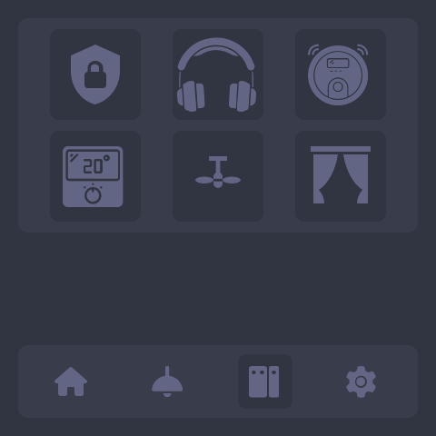 | 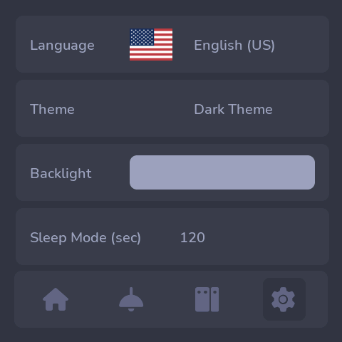 | 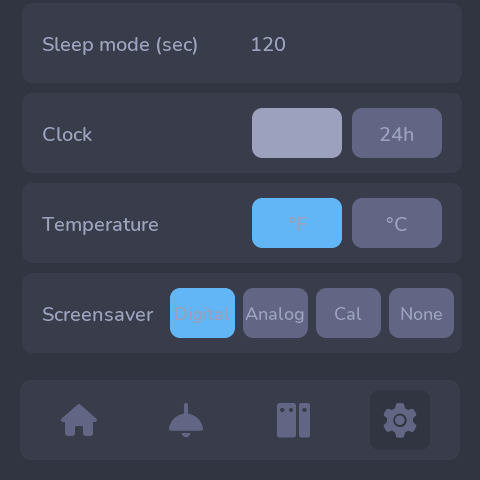 |

| 5-Day Weather Forecast | People |
|:---:|:---:|
| 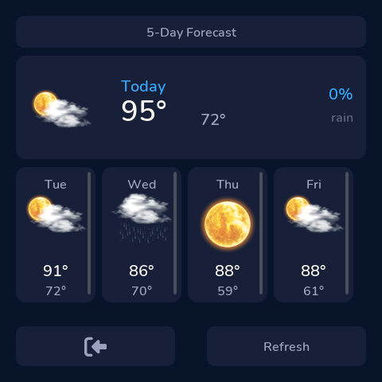 | 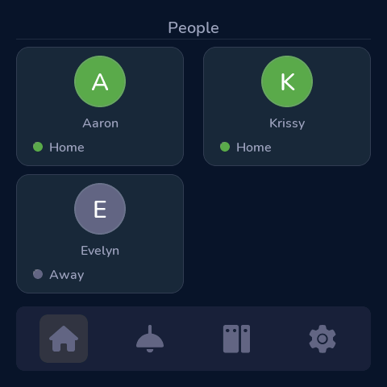 |

---

## Themes

6 built-in themes selectable from the Settings page:

| Cherry Blossom | Dark | Espeon |
|:---:|:---:|:---:|
| 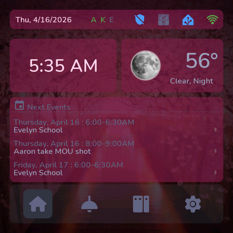 | 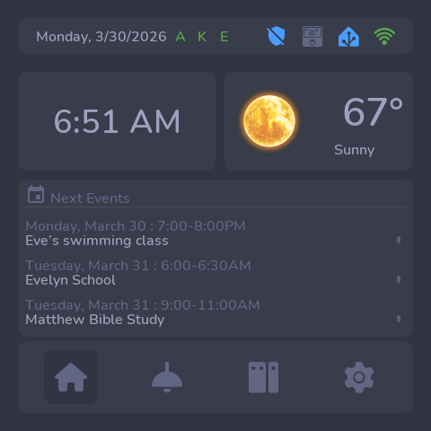 | 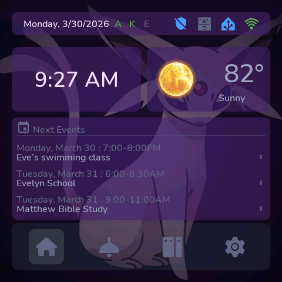 |

| Ocean | Paris | Patriotic |
|:---:|:---:|:---:|
| 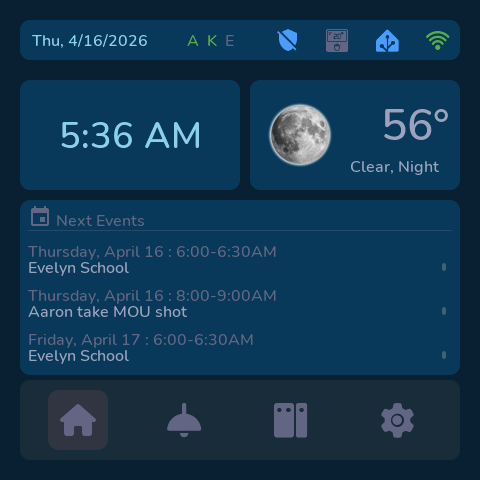 | 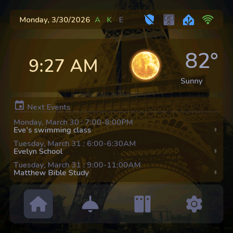 | 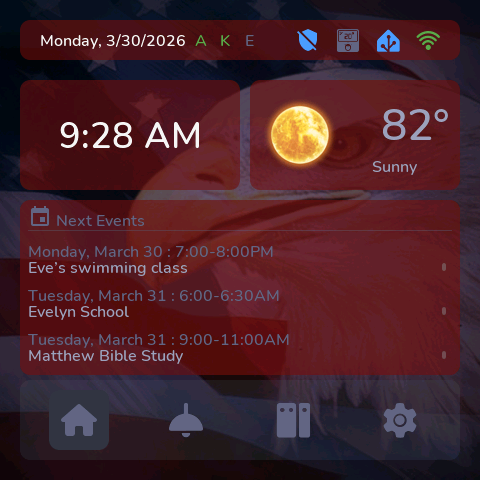 |

---

## Requirements

- **Hardware** — Guition ESP32-S3-4848S040 (480×480 capacitive touch display)
- **ESPHome** — 2024.6.0 or later
- **Home Assistant** — any recent version with the ESPHome integration
- **HA Custom Component** — [display-tools](https://github.com/alaltitov/homeassistant-display-tools) (required for translations and cover/media support)

---

## File Structure

```
/config/esphome/
├── Guition-ESP32/
│   ├── hardware.yaml               ← board-level config (display, touch, OTA, screensaver)
│   ├── widgets/
│   │   ├── preferences.yaml        ← display name overrides — page titles, button labels, translations
│   │   └── ...                     ← widget engine — do not edit
│   ├── fonts/
│   └── images/
├── main.yaml                       ← template — copy this for each device
├── configuration.yaml              ← HA template sensors (calendar events)
└── secrets.yaml                    ← OTA password, WiFi, PIN code
```

`main.yaml` contains **only** the `substitutions:` block and `packages:` list.  All hardware and engine logic lives in `Guition-ESP32/`.

---

## Preferences / Display Names

`Guition-ESP32/widgets/preferences.yaml` centralises every human-readable label on the display — page titles, button text, loading messages, and settings section headers.  It also contains the full runtime translation engine that applies the selected language live whenever the dropdown changes.

### Structure

The file is organised into three sections, in this order:

1. **`script: apply_ui_translations`** — the translation table.  Each row is one language; each column is one label.  Edit only the row(s) for the language(s) you want to customise.
2. **`substitutions:`** — compile-time English defaults.  Edit these to rename labels in English or to update the source strings that feed into the translation table.
3. **`select:` / `esphome:`** — wiring that calls the script on language change and at boot.  Do not edit these.

### Customising a translation

Find the language row inside `apply_ui_translations` and edit the string at the matching column.  The column index for every label is documented in the comments at the top of the script.

```yaml
// ── en – English (US) ← default if language index is out of range
{ "Alarm Panel",       "Covers",           "Fan Controls",       "Lights",   "Scenes",
  "People",            "5-Day Forecast",   "Chance of Rain",     "Refresh",
  ...
}
```

### Adding a new language

1. Copy any existing row in the table as a template and translate it.
2. Change `t[9][25]` to `t[10][25]` (increment the first dimension).
3. Add the new language option to `language_dropdown` in `settings_page.yaml` — the row index must match the dropdown option order (0-based).

### Customising English labels

Edit the `substitutions:` block at the bottom of the file.  Each key is annotated with what it controls.

```yaml
# preferences.yaml — English defaults (substitutions block)

# ── Page titles ───────────────────────────────────────────────────────────────
alarm_panel_page_title:  "Alarm Panel"
covers_page_title:       "Cover Controls"
fans_page_title:         "Fan Controls"
lights_page_title:       "Light Controls"
shortcuts_page_title:    "Scene Controls"
people_page_title:       "People"
forecast_page_title:     "5-Day Forecast"

# ── Cover detail-page action buttons ─────────────────────────────────────────
cover_open_label:  "Open"
cover_stop_label:  "Stop"
cover_close_label: "Close"

# ── HVAC fan mode buttons ─────────────────────────────────────────────────────
hvac_fan_auto_label: "Auto"
hvac_fan_on_label:   "On"

# ── Loading / boot screen ─────────────────────────────────────────────────────
loading_connecting_label: "Connecting to API..."
loading_sync_label:       "Synchronizing..."
loading_connected_label:  "Home Assistant Connected!"

# ── Settings page — section headings ─────────────────────────────────────────
settings_language_label:    "Language"
settings_theme_label:       "Theme"
settings_backlight_label:   "Backlight"
settings_sleep_label:       "Sleep Mode (sec)"
# ...and so on — see preferences.yaml for the full list
```

`preferences.yaml` is listed as the **first** package in every device file so its values override per-widget defaults.  Any substitution defined directly in your device file (e.g. `aaron.yaml`) still takes priority over `preferences.yaml` — allowing per-device label overrides without touching the shared file.

---

## Installation

### 1 · Copy files

Download or clone this repository into your ESPHome config directory so the folder structure matches the tree above.

### 2 · Create your device file

Copy `main.yaml` and rename it (e.g. `living-room.yaml`). **Edit only the `substitutions:` block** — everything below is the engine.

```yaml
substitutions:

  # ── 1 │ DEVICE ────────────────────────────────────────────────────
  esphome_name:          "living-room"          # hostname — lowercase, hyphens only
  esphome_friendly_name: "Living Room Display"
  ha_server:             "http://homeassistant.local:8123"
  time_zone:             "America/New_York"     # IANA tz name

  # ── 2 │ CORE ENTITIES ─────────────────────────────────────────────
  notification_entity: "input_text.display_notification"
  weather_entity:      "weather.forecast_home"
  temperature_entity:  "sensor.living_room_temperature"
  vacuum_entity:       "vacuum.roomba"
  media_player_entity: "media_player.living_room"
  alarm_panel_entity:  "alarm_control_panel.system"
  pin_code:            !secret security_pin_code

  # ── 3 │ PRESENCE  (up to 4) ───────────────────────────────────────
  person_entity_1:   "person.yourname"
  person_initials_1: "A"
  # unused → person_entity_N: "sensor.disabled"

  # ── 4 │ SCENE SHORTCUTS / 5 │ HVAC / 6 │ LIGHTS / 7 │ FANS / 8 │ COVERS ──
  # See main.yaml for full slot options and icon names
```

### 3 · Home Assistant setup

**a) Enable device actions**
In the ESPHome integration, open the device page and enable *"Allow the device to perform Home Assistant actions"*.

**b) Install display-tools**
Add [alaltitov/homeassistant-display-tools](https://github.com/alaltitov/homeassistant-display-tools) via HACS or manually to your HA instance.

**c) Add calendar template sensors**
Copy the contents of `configuration.yaml` (included in this repo) into your Home Assistant `configuration.yaml`, then restart HA.  Replace every occurrence of `calendar.yourcalendar_calendar` with your actual calendar entity ID.

```yaml
template:
  - trigger:
      - platform: time_pattern
        minutes: "/15"
      - platform: homeassistant
        event: start
    action:
      - action: calendar.get_events
        target:
          entity_id: calendar.yourcalendar_calendar          # ← change this
        data:
          start_date_time: "{{ now().isoformat() }}"
          duration:
            days: 30
        response_variable: agenda
      - variables:
          events: >
            {{ agenda['calendar.yourcalendar_calendar']['events']
               | rejectattr('start', 'match', '^\d{4}-\d{2}-\d{2}$')
               | sort(attribute='start')
               | list }}
          e1_summary: "{{ events[0].summary if events | length > 0 else 'No event' }}"
          e1_start:   "{{ events[0].start | as_datetime | as_local | as_timestamp | timestamp_custom('%Y-%m-%d %H:%M:%S') if events | length > 0 else '' }}"
          e1_end:     "{{ events[0].end   | as_datetime | as_local | as_timestamp | timestamp_custom('%Y-%m-%d %H:%M:%S') if events | length > 0 else '' }}"
          # e2, e3, e4 follow the same pattern — see configuration.yaml
    sensor:
      - name: "Calendar Upcoming Event 1"
        unique_id: calendar_upcoming_event_1
        state: "{{ e1_summary }}"
        attributes:
          message:    "{{ e1_summary }}"
          start_time: "{{ e1_start }}"
          end_time:   "{{ e1_end }}"
      # repeat for events 2, 3, 4 — see configuration.yaml
```

> **Timezone note:** Event times are converted to your local timezone using `as_local` before formatting. No UTC conversion is needed — HA handles the local offset automatically.

The calendar entity names default to `sensor.calendar_upcoming_event_1` through `_4`.  Only add substitutions if you renamed the sensors:

```yaml
  # Only needed if your sensor names differ from the defaults:
  # calendar_entity:   "sensor.my_custom_calendar_1"
  # calendar_entity_2: "sensor.my_custom_calendar_2"
  # calendar_entity_3: "sensor.my_custom_calendar_3"
  # calendar_entity_4: "sensor.my_custom_calendar_4"
```

**d) Create the notification helper**
- Go to **Settings → Devices & Services → Helpers → Create Helper → Text**
- Name: `display_notification` (entity ID: `input_text.display_notification`)
- Leave max length at the default (100)
- Trigger notifications from automations via `input_text.set_value`; the banner dismisses after 10 s or when tapped

**e) Add secrets**

```yaml
# secrets.yaml
display_ota: "your-ota-password"
wifi_ssid:   "YourWiFi"
wifi_password: "YourPassword"
security_pin_code: "1234"
```

### 4 · Flash

```bash
esphome run living-room.yaml
```

---

## HVAC Options

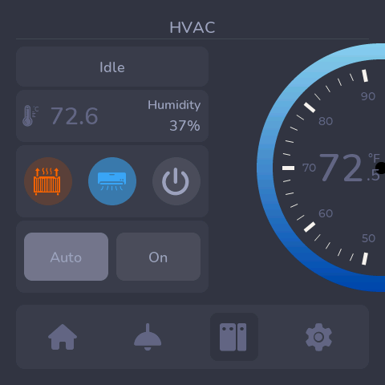

Set the entity substitution(s) and uncomment the matching `devices:` / `hvac:` package lines in the ENGINE block of your device file. The nav button icon is set automatically — no `hvac_icon` needed.

| Option | Use when… | Entities to set | Package line |
|---|---|---|---|
| **Option 1** (default) | Single HA `climate` entity handles heat + cool | `hvac_entity` | `hvac: hvac_widget.yaml` |
| **Option 2** | Thermostat only (heat) | `thermostat_entity` | `hvac: thermostat_widget.yaml` |
| **Option 3** | Air conditioner only (cool) | `air_conditioner_entity` | `hvac: air_conditioner_widget.yaml` |
| **Option 4** | Separate thermostat + AC units | `thermostat_entity` + `air_conditioner_entity` | `devices: hvac_combo_bundle.yaml` (replaces `devices:` + `hvac:`) |

Option 4 is a single package that bundles the devices page and both widgets — page IDs and the theme script page reference are handled automatically.

### Widget layout (Option 1 — combined HVAC)

The left panel contains:
- **State bar** — current HVAC mode (Heating / Cooling / Idle / Off, etc.)
- **Info row** — current temperature (with thermometer icon) on the left; humidity label + value on the right
- **Mode buttons** — Heat / Cool / Auto / Off
- **Fan mode buttons** — Auto / On

The right side shows an **arc dial** for the set-point temperature.  The set-point value is overlaid at the centre of the arc on a transparent background, so the arc gradient shows through behind it.

---

## Lights, Fans, Covers & Scene Shortcuts

| Lights | Fans | Covers |
|:---:|:---:|:---:|
| 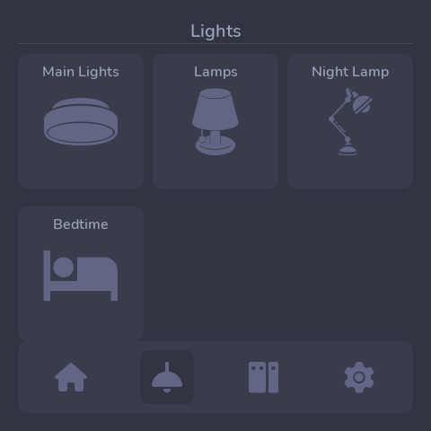 | 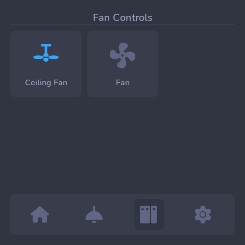 | 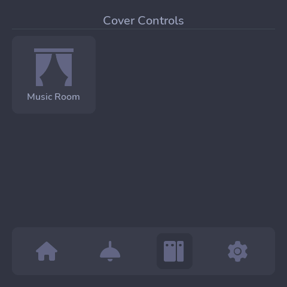 |

Up to **6 lights**, **6 fans**, **6 covers**, and **6 scene shortcuts** can be configured. Set unused slots to `sensor.disabled` — they are hidden automatically at boot and do not leave gaps in the grid. All icons are set by name from the shared icon library — no unicode codepoints or font IDs required.

```yaml
# ── Light slot ────────────────────────────────────────────────────────────────
light_entity_1:     "light.living_room"
light_label_name_1: "Living Room"
light_type_1:       "light"           # light | switch | input_boolean
light_icon_1:       "lamp"            # see icon library below
light_icon_font_1:  "lamp_font"       # always pair icon and font (see icon library)

# ── Fan slot ──────────────────────────────────────────────────────────────────
fan_entity_1:     "fan.ceiling_fan"
fan_label_name_1: "Ceiling Fan"
fan_type_1:       "fan"              # fan | switch | input_boolean
fan_icon_1:       "ceiling_fan"      # see icon library below
fan_icon_font_1:  "ceiling_fan_font"

# ── Cover slot ────────────────────────────────────────────────────────────────
cover_entity_1:     "cover.living_room_blinds"
cover_label_name_1: "Living Room"
cover_icon_1:       "curtains"       # see icon library below
cover_icon_font_1:  "curtains_font"

# ── Scene / script / automation slot ─────────────────────────────────────────
scene_entity_1:  "scene.morning"
scene_label_1:   "Morning"
scene_type_1:    "scene"             # scene | script | automation
scene_icon_1:    "movie"             # see icon library below
scene_icon_font_1: "movie_font"
```

### Icon Library

Every icon has a paired `_font` substitution that must be set alongside the icon name.  Both values come from the table below.

| Icon name | `_font` value | Visual |
|---|---|---|
| `lamp` | `lamp_font` | mdi:lamp (table/floor lamp) |
| `night_lamp` | `night_lamp_font` | mdi:wall-sconce-round |
| `post_lamp` | `post_lamp_font` | mdi:post-lamp (outdoor post light) |
| `ceiling_lamp` | `ceiling_lamp_font` | Custom ceiling lamp |
| `ceiling_lamp_variant` | `ceiling_lamp_variant_font` | Custom ceiling lamp variant |
| `lightbulb` | `lightbulb_font` | Custom lightbulb |
| `spotlights_group` | `spotlights_group_font` | Custom spotlights |
| `desk_lamp` | `desk_lamp_font` | Custom desk lamp |
| `pendant_lamp` | `pendant_lamp_font` | Custom pendant lamp |
| `ceiling_fan` | `ceiling_fan_font` | mdi:ceiling-fan |
| `floor_fan` | `floor_fan_font` | mdi:fan |
| `curtains` | `curtains_font` | mdi:curtains |
| `garage` | `garage_font` | Custom garage door |
| `blinds` | `blinds_font` | mdi:blinds |
| `movie` | `movie_font` | mdi:movie |
| `movie_clapper` | `movie_clapper_font` | Custom movie clapper |
| `play_circle` | `play_circle_font` | mdi:play-circle |
| `music` | `music_font` | Custom music note |
| `bed` | `bed_font` | mdi:bed |
| `heart` | `heart_font` | mdi:heart |
| `tv` | `tv_font` | mdi:television |

**Default icons per widget type:**

| Widget | Slot default |
|---|---|
| Lights (slots 1–3) | `lamp` / `lamp_font` |
| Lights (slots 4–6) | `bed`, `heart`, `tv` |
| Fans (all slots) | `ceiling_fan` / `ceiling_fan_font` |
| Covers (all slots) | `curtains` / `curtains_font` |
| Scenes (all slots) | `movie` / `movie_font` |

The light detail page automatically shows a colour temperature slider the first time HA sends a `color_temp` attribute.

### Fan types

| `fan_type` value | Behaviour |
|---|---|
| `fan` | Full fan entity — speed slider shown on detail page |
| `switch` | Simple on/off — speed panel hidden |
| `input_boolean` | Same as switch |

### Devices hub auto-layout

When all slots for a widget type are `sensor.disabled`, that widget's nav button is hidden on the Devices page.  The remaining optional buttons (Fans, Shortcuts, Covers) are automatically repacked into the available slots with no blank gaps.  The container height also shrinks from 3 rows to 2 when only the fixed widgets remain.

---

## Presence & People


Up to 4 person entities are tracked in real time.  Initials appear in the top indicator bar coloured green when home and dim when away.  Tapping the indicator bar opens the People page, which shows a card per person with:

- **Avatar circle** with initials (coloured green when home)
- **Full name** fetched automatically from the HA `friendly_name` attribute
- **Status dot + label** (Home / Away)

Cards for `sensor.disabled` slots are hidden automatically.

```yaml
person_entity_1:   "person.yourname"
person_initials_1: "A"               # shown in the top bar + on the avatar

person_entity_2:   "person.partner"
person_initials_2: "K"

# Unused slots
person_entity_3:   "sensor.disabled"
person_initials_3: ""
```

---

## Weather


Displays current conditions with a title-cased state and a **5-day forecast** showing high/low temperatures, weather icons, and rain probability (shown above each day's value). Set the `weather_entity` substitution to your Home Assistant weather entity (e.g. `weather.forecast_home`).

---

## Screensaver

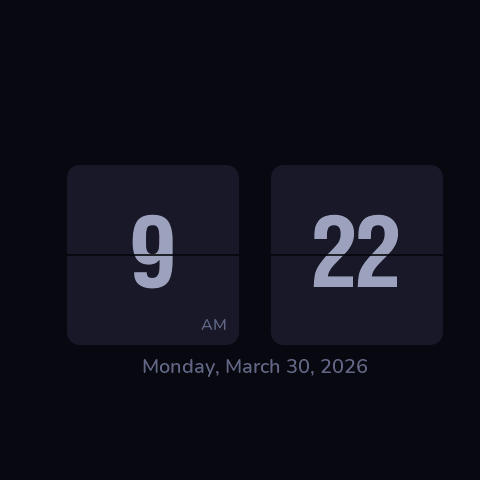

Three screensaver styles are available, selectable from **Settings → Screensaver**:

| Style | Behaviour |
|---|---|
| **Digital** | Large digital clock + date |
| **Flip** (default) | Retro Gluqlo-style flip clock — separate hour and minute panels with date below |
| **None** | Screen dims to near-off (backlight ~1%) |

- The screensaver activates after the configured idle timeout (default **120 s**)
- **Digital / Flip**: brightness adjusts automatically — 90% during the day (08:00–19:59), 10% at night (20:00–07:59)
- **None**: backlight dims to ~1% — the screen is effectively off but touch still works
- Tapping anywhere dismisses the screensaver, restores backlight to the saved user brightness, and navigates to the **Home** page
- **Show Calendar Events** (Settings checkbox) — when enabled, the next 3 upcoming events are overlaid below the clock on both Digital and Flip styles

---

## Notifications

Write any text to the configured `input_text` entity from a HA automation:

```yaml
- action: input_text.set_value
  target:
    entity_id: input_text.display_notification
  data:
    value: "Front door open"
```

The banner appears at the bottom of the screen for 10 seconds then auto-dismisses. Tap the banner to dismiss early. Setting the entity value to an empty string also clears it. Blank, `unknown`, and `unavailable` states are ignored.

---

## Remote Screenshot

The `display_capture` external component exposes two HTTP endpoints on the device's built-in web server:

| Endpoint | Method | Description |
|---|---|---|
| `/screenshot` | GET | Returns a BMP image of the current screen |
| `/screenshot?page=N` | GET | Switches to page N, captures, then restores |
| `/screenshot/info` | GET | Returns JSON metadata (width, height, page count, mode) |

**Requirements** — add these to `hardware.yaml` (already included in this repo):

```yaml
web_server:
  port: 80

external_components:
  - source:
      type: local
      path: Guition-ESP32/components
    components: [display_capture]

display_capture:
  display_id: my_display
  backend: st7701s
```

**Usage:**

```bash
# Save a screenshot to disk
curl http://living-room.local/screenshot --output screen.bmp

# Get display info
curl http://living-room.local/screenshot/info
# → {"width":480,"height":480,"pages":1,"mode":"single"}
```

The component reads the framebuffer directly from the ESP-IDF RGB panel driver (`esp_lcd_rgb_panel_get_frame_buffer`) — no display redraw or flicker occurs during capture.

---

## Settings Defaults

| Setting | Default |
|---|---|
| Language | English (US) |
| Theme | Dark |
| Backlight | 100% |
| Sleep mode | 120 s |
| Clock format | 12h (AM/PM) |
| Temperature unit | °F |
| Screensaver | Flip |

All settings are persisted across reboots via NVS flash storage.

---

## 3D Print Stand

A desk stand for this display is available on MakerWorld:
[Guition ESP32-S3 4848S040 Desk Stand](https://makerworld.com/en/models/1587503-guition-esp32-se-4848s040-desk-stand#profileId-1671461)

---

## Credits

- Original project: [alaltitov/Guition-ESP32-S3-4848S040](https://github.com/alaltitov/Guition-ESP32-S3-4848S040)
- Built with [ESPHome](https://esphome.io) and [LVGL](https://lvgl.io)
